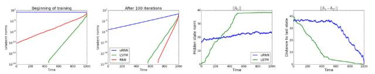

[complex-valued neural networks (CVNNs)](#head1)

- [ 1.什么是复数神经网络？](#head2)
- [ 2.复数神经网络+量子计算？](#head3)
- [ 3.问题？](#head4)
- [ 4.复数可以提供哪些实数不能提供的东西？](#head5)
- [5.论文：深度复数网络（Deep Complex Networks）](#head6)
- [ 6.神经网络中复数函数求导](#head7)
  - [ Holomorphism与Cauchy-Riemann方程](#head8)
  - [ Wirtinger算子](#head9)
  - [ 复数变量的反向传播](#head10)
  - [ 简单测试](#head11)
  - [ 关于复数神经网络的思考](#head12)
  - [ 代码](#head13)
- [ 其他问题与参考](#head14)

# complex-valued neural networks (CVNNs)

## 1.什么是复数神经网络？

单值函数和人类的基于脉冲信号处理（信号是复数域的）完全不同，
生物学家也证明了生物神经单元的结构和功能都远比基于单值函数MLP模型的人工神经元要复杂的多。
很早就有人提出了在复数域上处理信息的神经网络，叫复数神经网络，扩展到复数域后就能处理时序信息。
（采用傅立叶变换，可以将任意一维连续时序信号转化到频域上成为离散的脉冲，就能用机器进行处理）
但没有为AI发展做出较大贡献，原因猜测是复数域的模型太难训练了，而且推理速度也比单值函数的神经网络模型要慢。
实数域上的训练系统是以反向传播自动梯度推导为基础的，这一套系统和实现已经相当完善，而复数域的几乎没看到过确定可用的方法。

## 2.复数神经网络+量子计算？

> 复数域上的人工神经网络与量子计算https://www.cnblogs.com/thisisajoke/p/12749921.html

## 3.问题？

Perhaps by utilizing imaginary numbers, neural networks will be able to explore a potential farther than they ever could currently.

Fortunately, this problem has not been left completely untouched, and there has been a decent amount of research conducted on complex-valued neural networks (CVNNs). The first problem addressed in almost all of these papers is the activation function — in order for backpropagation to work, an activation function that facilitates in the nonlinearity of a network must be analytic, or differentiable at all points. The Liouville theorem, however, shows that every bounded (closed) function on the complete complex plane *must* be constant, and hence, linear.

幸运的是，这个问题还没有被完全解决，并且对复值神经网络(CVNN)进行了大量的研究。 几乎所有这些论文中都解决的第一个问题是激活函数，为了使反向传播起作用，必须分析或在所有点上求导可促进网络非线性的激活函数。 但是，Liouville定理表明，完整复平面上的每个有界(封闭)函数都*必须*是常数，因此*必须*是线性的。

Therefore, in order to fulfill the purpose of the activation function, **bounded functions like sigmoid and the hyperbolic tangent have no place in CVNNs**. When applied to the complex plane, these bounded functions have singularity points — points that are not differentiable — that occur periodically in the space. At these singularity points, the function explodes towards infinity, causing the neural network computations to go haywire.

因此，为了实现激活函数的目的，诸如S形和双曲线正切之类的有界函数在CVNN中没有位置。 当应用于复杂平面时，这些有界函数具有奇点(不可微分的点)，这些奇点在空间中定期出现。 在这些奇点处，函数向无穷大爆炸，导致神经网络计算陷入困境。

**A common work-around this problem in the research of CVNNs is to use a complex sigmoid function**, which inevitably will have certain singularity points at infinity, but to limit the search space for weights and bias parameters so that they always remain within a ‘safe’ region and never come even close to a computational explosion.

在CVNN的研究中，解决此问题的常见方法是使用复杂的S型函数，该函数不可避免会在无穷大处具有某些奇点，但会限制权重和偏差参数的搜索空间，以使它们始终保持在“安全范围内”。区域，而且永远都不会接近计算爆炸式增长。

Although there is significant mathematical work involved, simply put, **a backpropagation algorithm for a complex-valued neural network needs to take into account the error with respect not only to the real component of a weight but also the imaginary component**. Because it deals with these components separately, **it expands the search space dimensionality by a magnitude of two**.

简而言之，尽管涉及大量的数学工作，但用于复值神经网络的反向传播算法不仅需要考虑权重的实部，还需要考虑虚部。 由于它分别处理这些组件，因此将搜索空间维数扩展了两个数量级。

## 4.复数可以提供哪些实数不能提供的东西？

DeepMind 的论文《Associative Long Short-Term Memory》（Ivo Danihelka, Greg Wayne, Benigno Uria, Nal Kalchbrenner, Alex Graves）

根据数学原理，与仅仅使用实数的情况相比，使用复数需要的矩阵更小。如下图所示，使用复数的神经网络在内存开销上与传统 LSTM 有显著区别。


《Unitary Evolution Recurrent Neural Networks》（Martin Arjovsky, Amar Shah, Yoshua Bengio）一文中探讨了酉矩阵。他们认为，如果矩阵的特征值接近 1 的话，消失的梯度或许会带来实际的好处。该研究使用复数作为 RNN 网络的权重。实证表明我们的 uRNN 能够更好地通过长序列传递梯度信息，并且不会遇到像 LSTM 一样多的饱和隐藏状态（saturating hidden states）。




《Kronecker Recurrent Units》（Cijo Jose, Moustpaha Cisse, Francois Fleuret）他们在论文里也展现了在复制任务中使用酉矩阵的可行性。他们展示了一种能够大幅减少所需参数的矩阵分解方法。文中描述了他们使用复数的动机。

**由于实空间的行列式是连续函数，所以实空间的酉集是不连贯的。因而，使用标准的连续优化程序不能在实值网络上跨越全酉集。相反，酉集在复空间中是连接在一起的，因为它的行列式是复空间中单位圆上的点，所以使用复数就不会出现这个问题。**

MILA（蒙特利尔学习[算法](http://www.dataguru.cn/article-5747-1.html?union_site=innerlink)研究所）最近的一篇论文《Deep Complex Networks》（Chiheb Trabelsi 等人）进一步探索了这些方法在卷积神经网络上的使用。

《Numerics of GANs》（Lars Mescheder, Sebastian Nowozin, Andreas Geiger）探讨了 GAN 中棘手的收敛性能。他们研究了带有复数值的雅克比矩阵的特点，并使用它创建解决 GAN 均衡问题的较先进方法

量子力学可以被认为是使用了一种更加通用的概率形式。对复数的使用则提供了常规概率无法提供的额外能力。

本文提及的研究论文证明了：在深度学习架构中使用复数确实会带来「实实在在」的优势。研究表明：使用复数能够带来更鲁棒的层间梯度信息传播、更高的记忆容量、更准确的遗忘行为、大幅降低的网络规模，以及训练 GAN 时更好的稳定性。这些优点可不能被简单地忽略。如果我们接受了目前深度学习的主流观点--任何一层的微分都是公平的，那么或许我们应该使用存储多种变体的复分析。

或许复数没有被经常使用的原因是研究者对它不够熟悉。在优化研究社区中，数学传统并没有涉及到复数。然而物理学家却一直在使用复数。那些虚部在量子力学中始终是存在的。这并不奇怪，这就是现实。我们仍然不太理解为何这些深度学习系统会如此有用。所以探索其他的表示可能会带来出乎意料的突破。

在不久的将来，这个局面可能会变化。较先进的结构可能会普遍使用复数，那时候不使用复数反倒变得奇怪了。

> 深度学习应该使用复数吗？http://www.dataguru.cn/article-12250-1.html

## 5.论文：深度复数网络（Deep Complex Networks）

目前，深度学习的绝大多数构建模块、技术和架构都基于实数值的运算和表征。但是，近来在循环神经网络和其它更古老的基础理论上的分析表明复数可以有更加丰富的表征能力，也可以促进对噪声鲁棒的记忆检索机制。尽管它们在带来全新的神经架构上有引人注目的性质和潜力，但由于缺少设计这种模型所需的构建模块，复数值的深度神经网络一直处于边缘化的状态。在这项研究中，我们提供了可用于复数值深度神经网络的关键基本组件，并将它们应用到了卷积前馈网络中。更准确地说，我们依靠复数卷积，提出了可用于复数值深度神经网络的复数批规范化、复数权重初始化策略，并且我们还在端到端的训练方案中对它们进行了实验。我们表明，这样的复数值模型可以实现与其对应的实数值模型相媲美或更好的表现。我们在一些计算机视觉任务和使用 MusicNet 数据集的音乐转录任务上对深度复数模型进行了测试，实现了当前最佳的表现。

**1 引言**

本论文的贡献如下：

\1. 对复数批规范化（complex batch normalization）进行了形式化，详见 3.4 节；

\2. 复数权重初始化，详见 3.5 节；

\3. 在多乐器音乐转录数据集（MusicNet）上达到了当前最佳的结果，详见 4.2 节。

**3 复数构建模块**

在这一节，我们给出了我们研究成果的核心，为实现复数值的深度神经网络构建模块制定了数学框架。


*图 1：复数卷积和残差网络实现细节*

- 3.1 复数的表征
- 3.2 复数卷积
- 3.3 深度复数网络的深度和宽度
- 3.4 复数批规范化
- 3.5 复数权重初始化
- 3.6 复数卷积残差网络

**4 实验结果**

在这一节，我们给出了我们的模型在图像和音乐分类任务上的实验结果。首先，我们给出了我们的模型架构，然后给出了其在三个标准图像分类基准（CIFAR-10、CIFAR-100 和 SVHN）上的结果，另外还有在 MusicNet 基准上的自动音乐转录结果。

- 4.1 图像识别
- 

*表 1：模型架构。S1、S2 和 S3 Filters 分别是指在 stage 1、2 和 3 每一层所使用的卷积滤波器的数量。(S) 表示小网络，(L) 表示大网络。*


*表 2：在 CIFAR-10、CIFAR-100 和 SVHN 上的分类误差。注意 He et al. [2016] 使用了 110 层的模型*

- 4.2 在 MusicNet 数据集上的自动音乐转录

  

*表 3：MusicNet 实验。FS 表示采样率。Params 是参数的总数量。我们给出了平均精度（AP）指标，是指精度召回曲线（precision-recall curve）下的面积。*


*图 5：精度召回曲线* 

## 6.神经网络中复数函数求导

> - **本文作者：** zdaiot
> - **本文链接：** https://www.zdaiot.com/DeepLearningApplications/极化SAR/神经网络中复数函数求导/
> - **版权声明：** 本博客所有文章除特别声明外，均采用[ BY-NC-SA](https://creativecommons.org/licenses/by-nc-sa/4.0/) 许可协议。转载请注明出处！

复数神经网络有以下几个特点：

- 网络的输入与权重均为复数
- 损失值为实数

本文的内容主要包含一下几个部分：

- 推导复数神经网络的反向传播公式
- 为复数神经网络的反向传播完成通用代码

### Holomorphism与Cauchy-Riemann方程

Holomorphism（全纯）也称为analyticity，维基百科的定义为：

若$U$为$C$的开子集（开集是指不包含任何自己边界点的集合。或者说，开集包含的任意一点的充分小的邻域都包含在其自身中），且$f:U→C$为一个函数。

我们称$f$是在$U$中**一点$z_0$是复可微（complex differentiable）或全纯的**，当且仅当该极限存在：

$\begin{eqnarray} f'(z_0)=lim_{z \rightarrow z_0} \frac{f(z)-f(z_0)}{z-z_0} \end{eqnarray}$


若$f$在$U$上**任取一点均全纯，则称$f$在$U$上全纯**。特别地，若函数在整个复平面全纯，我们称这个函数为整函数。

在论文《Deep complex networks》中，是这样定义的（其实和维基百科上定义一致，但是一般英文表述比较严谨，所以放在这里）

Holomorphism , also called analyticity, ensures that a complex-valued function is complex differentiable in the neighborhood of every point in its domain. This means that the derivative,$ f '(z_0)≡
lim∆z→0[ (f(z_0)+∆z)−f(z_0)∆z] $of $f$, exists at every point $z_0$ in the domain of $f$ where $f$ is a complex-valued function of a complex variable $z = x + i y $  such that $f(z) = u(x, y) + i v(x, y)$. 

$u$和$v$均为实值函数，所以$Δz$可以使用$Δz=Δx+iΔy $表达。$Δz$可以从不同的方向逼近0（实轴、虚轴、实轴与虚轴之间）。为了复数可微分，$f′(z_0)$不管从哪个方向逼近0，值应该都相同。

当$Δz$从实轴逼近0的时候，$f′(z_0)$可以写成：
$$
\begin{eqnarray} \begin{split} f'(z_0) & \equiv & lim_{\Delta z \rightarrow 0} \frac{f(z_0+\Delta z)-f(z_0)}{\Delta z} \\
& =&  \lim_{\Delta x \rightarrow 0} \lim_{\Delta y \rightarrow 0} \left[ \frac{\Delta u(x_0, y_0) + i \Delta v(x_0, y_o)}{\Delta x + i \Delta y} \right] \\ 
& =&  \lim_{\Delta x \rightarrow 0} \left[ \frac{\Delta u(x_0, y_0) + i \Delta v(x_0, y_o)}{\Delta x + i 0} \right] \end{split} \end{eqnarray}
$$


当$\Delta z$从虚轴逼近0的时候，$f’(z_0)$可以写成：
$$
\begin{eqnarray} \begin{split} f'(z_0) & \equiv & lim_{\Delta z \rightarrow 0} \frac{f(z_0+\Delta z)-f(z_0)}{\Delta z} \\
& =&  \lim_{\Delta x \rightarrow 0} \lim_{\Delta y \rightarrow 0} \left[ \frac{\Delta u(x_0, y_0) + i \Delta v(x_0, y_o)}{\Delta x + i \Delta y} \right] \\ 
& =&  \lim_{\Delta y \rightarrow 0} \left[ \frac{\Delta u(x_0, y_0) + i \Delta v(x_0, y_o)}{0 + i \Delta y} \right] \end{split} \end{eqnarray}
$$


要想使得上面两公式相等，则需要满足下式：
$$
\begin{eqnarray} \frac{\delta f}{\delta z}=\frac{\delta u}{\delta x}+i\frac{\delta v}{\delta x} = -i \frac{\delta u}{\delta y}+\frac{\delta v}{\delta y} \end{eqnarray}
$$
为了复数可微分，$f$应该满足：
$$
\begin{eqnarray} \begin{split}
\frac{\delta u}{\delta x}& = &\frac{\delta v}{\delta y} \\
\frac{\delta u}{\delta y}& = &-\frac{\delta v}{\delta x}
 \end{split} \end{eqnarray}
$$


这被称为Cauchy-Riemann方程（黎曼方程），它是$f$复微分的必要条件。假设$u$和$v$具有连续的一阶偏导数，则Cauchy-Riemann方程成为$f$为Holomorphism的充分条件。

另外，论文中提到Hirose and Yoshida (2012) [1] 证明了**对于反向传播，不一定需要函数为Holomorphism，主需要函数关于实部和虚部分别求导即可。**


### Wirtinger算子

Wirtinger算子的思路是，将任何复变函数$f$，看做$f(z,z^*)$，求导数就是对$z$和共轭$z^*$分别求导：
$$
\begin{eqnarray}  df = \frac{\delta f}{\delta z}dz +  \frac{\delta f}{\delta z^*}dz^* \end{eqnarray}
$$
其中：


$$
\begin{eqnarray} \frac{\delta f}{\delta z} = \frac{\delta f}{\delta x} -j \frac{\delta f}{\delta y} \end{eqnarray}
$$

$$
\begin{eqnarray}  \frac{\delta f}{\delta z^*} = \frac{\delta f}{\delta x} + j \frac{\delta f}{\delta y} \end{eqnarray}
$$

> 综上，算法流程如下：
>
> 1) 全纯函数y=f(w):
> 由于dy/dw*=0，由推导可知，梯度与实数域结果一样，无需额外实现
> 2)非全纯函数y=f(w,w*):
> a, 求得g1 = dy/dw，g2 = dy/dw*。
> b, 拿到上层backward回来的梯度，也就是grad_output
> c, 求得本节点的梯度 += grad_output.g1* + grad_output*.g2
>
> https://zhuanlan.zhihu.com/p/86280502

### 复数变量的反向传播

设$J(z)$是定义在复平面$z=x+iy$上的实值损失函数，则根据Wirtinger算子，$J(z)$关于$z$的梯度为：
$$
\begin{align}\begin{split}\nabla J(z) &= \frac{\partial J}{\partial x} + i\frac{\partial J}{\partial y}\\&= \frac{\partial J}{\partial z}\frac{\partial z}{\partial x}+\frac{\partial J}{\partial z^*}\frac{\partial z^*}{\partial x}+ i\left[\frac{\partial J}{\partial z}\frac{\partial z}{\partial y}+\frac{\partial J}{\partial z^*}\frac{\partial z^*}{\partial y}\right]\\&=2\frac{\partial J}{\partial z^*}=2\left(\frac{\partial J}{\partial z}\right)^*\end{split}\end{align}
$$
在最后一层中，我们使用了实数$J$，对于前面的层只需要一层一层的向前传播即可。
$$
\frac{\partial J}{\partial y_l}=\sum\limits_{y_{l+1}}\frac{\partial J}{\partial y_{l+1}}\frac{\partial y_{l+1}}{\partial y_l}+\frac{\partial J}{\partial y^*_{l+1}}\frac{\partial y_{l+1}^*}{\partial y_l}.
$$
其中$y_{l}$和$y_{l+1}$分别是第$l$层和第$l+1$的变量；$y_{l+1}=f_l(y_l)$。

复变函数按照是否可导，分为全纯函数holomothic和nonholomophic，判断条件为Cauchy-Riemann方程。

- 如果$f_l$是**holomophic**（全纯函数），那么上面的第二项消失，变成了：
  $$
  \frac{\partial J}{\partial y_l}=\sum\limits_{y_{l+1}}\frac{\partial J}{\partial y_{l+1}}\frac{\partial y_{l+1}}{\partial y_l},
  $$

- 如果$f_l$为nonholomophic

$$
\frac{\partial J}{\partial y_l}=\sum\limits_{y_{l+1}}\frac{\partial J}{\partial y_{l+1}}\frac{\partial y_{l+1}}{\partial y_l}+\left(\frac{\partial J}{\partial y_{l+1}}\frac{\partial y_{l+1}}{\partial y_l^*}\right)^*.
$$


> 这种思路不同与论文《Deep complex networks》中求导方式，在这种思路中，权重和输入均为复数矩阵，求导时要损失函数对于整个复数求导；而在上述论文中，输入和权重必须可以均为实数（即使用双倍的实数网络代替复数网络），求导时可以分别求实部和虚部的偏导数。

### 简单测试

给定一个长度为10的向量$x$，网络的损失函数为$J=f_2\left( f_1 \left( f_x(x) \right) \right)$。其中$f_1(z)=z^*$，$f_2 (z)=-e ^{-|z|^2}$。这是一个简单的方程，naive BP像实数网络会失败，代码在最下面给出：


而正确的方程正确的收敛到了-10.

### 关于复数神经网络的思考

许多计算机科学的人强调复数函数可以使用双倍尺寸的实数网络代替，这是不正确的。这让我们想到一个问题：为什么需要复数值。若没有复数值，那么

- unitary矩阵（酉矩阵）不能很容易的实现
- 相位性质不能很好的表达，光和全息图，声音，量子波函数等

**虽然一个复数神经网络必须包含至少一个nonholomophic函数（让损失值为正值）**。我认为复数函数的价值在于holomothic，如果一个函数是nonholomophic，那么它和双倍尺寸的复数值网络没有太大区别。

复数神经网络倾向于blow up，那也意味着，不能定义soft函数，像sigmoid和tanh。

### 代码

```
'''
Test complex back propagation.
The theory could be found in Akira's book "Complex Valued Neural Networks".
'''

import numpy as np
from matplotlib.pyplot import *

# define two useful functions and their derivatives.
def f1_forward(x): return x.conj()


def df1_z(x, y): return np.zeros_like(x, dtype='complex128')


def df1_zc(x, y): return np.ones_like(x, dtype='complex128')


def f2_forward(x): return -np.exp(-x * x.conj())


def df2_z(x, y): return -y * x.conj()


def df2_zc(x, y): return -y * x

# we compare the correct and incorrect back propagation
def naive_backward(df_z, df_zc):
    '''
    naive back propagation meta formula,
    df_z and df_zc are dirivatives about variables and variables' conjugate.
    '''
    return lambda x, y, dy: df_z(x, y) * dy


def correct_backward(df_z, df_zc):
    '''the correct version.'''
    return lambda x, y, dy: df_z(x, y) * dy +\
                    df_zc(x, y).conj() * dy.conj()


# the version in naive bp
f1_backward_naive = naive_backward(df1_z, df1_zc)
f2_backward_naive = naive_backward(df2_z, df2_zc)

# the correct backward propagation
f1_backward_correct = correct_backward(df1_z, df1_zc)
f2_backward_correct = correct_backward(df2_z, df2_zc)

# initial parameters, and network parameters
num_input = 10
a0 = np.random.randn(num_input) + 1j * np.random.randn(num_input)
num_layers = 3


def forward(x):
    '''forward pass'''
    yl = [x]
    for i in range(num_layers):
        if i == num_layers - 1:
            x = f2_forward(x)
        else:
            x = f1_forward(x)
        yl.append(x)
    return yl


def backward(yl, version):  # version = 'correct' or 'naive'
    '''
    back propagation, yl is a list of outputs.
    '''
    dy = 1 * np.ones(num_input, dtype='complex128')
    for i in range(num_layers):
        y = yl[num_layers - i]
        x = yl[num_layers - i - 1]
        if i == 0:
            dy = eval('f2_backward_%s' % version)(x, y, dy)
        else:
            dy = eval('f1_backward_%s' % version)(x, y, dy)
    return dy.conj() if version == 'correct' else dy


def optimize_run(version, alpha=0.1):
    '''simple optimization for target loss function.'''
    cost_histo = []
    x = a0.copy()
    num_run = 2000
    for i in range(num_run):
        yl = forward(x)
        g_a = backward(yl, version)
        x[:num_input] = (x - alpha * g_a)[:num_input]
        cost_histo.append(yl[-1].sum().real)
    return np.array(cost_histo)


if __name__ == '__main__':
    lr = 0.01
    cost_r = optimize_run('naive', lr)
    cost_a = optimize_run('correct', lr)
    figure(figsize=(5,3))
    plot(cost_r, lw=2)
    plot(cost_a, lw=2)
    legend(['Naive', 'Correct'])
    ylabel(r'$e^{-|(x^*)^*|^2}$', fontsize = 18)
    xlabel('step', fontsize = 18)
    tight_layout()
    show()
```


## 其他问题与参考

> 基于c-r微分算子的复值神经网络学习算法研究https://www.doc88.com/p-2922554811565.html
>
> Complex-Valued Neural Networks: Learning Algorithms and Applicationshttps://www.semanticscholar.org/paper/Complex-Valued-Neural-Networks%3A-Learning-Algorithms-Amin/c9abf23d39a480bc2810082785792d9f27cb2bdb?p2df
>
> 搭建复数神经网络遇到的问题https://blog.csdn.net/qq_39267907/article/details/88067285
>
> [ChihebTrabelsi](https://github.com/ChihebTrabelsi)/**[deep_complex_networks](https://github.com/ChihebTrabelsi/deep_complex_networks)**


